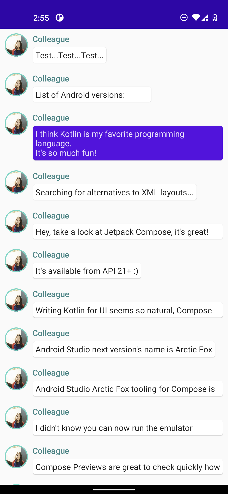
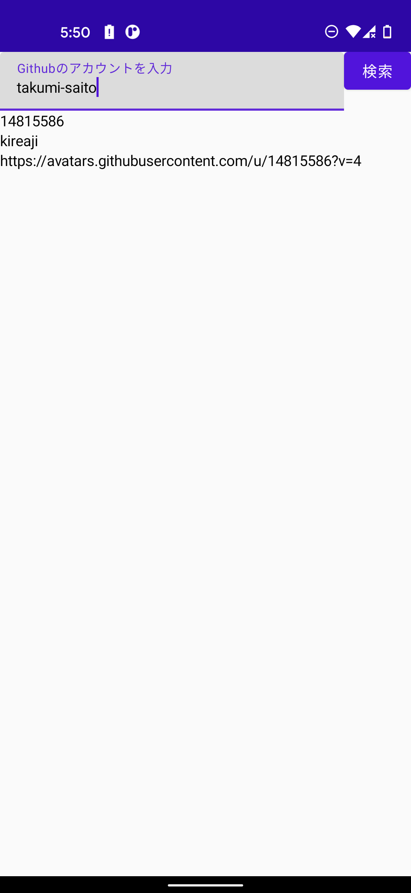

# JetpackCompose Tutorial

This folder is the source code learned at the following site. 
https://developer.android.com/jetpack/compose/tutorial

Learn from the books below. 
[book](https://www.amazon.co.jp/Jetpack-Compose%E3%81%AB%E3%82%88%E3%82%8BAndroid-MVVM%E3%82%A2%E3%83%BC%E3%82%AD%E3%83%86%E3%82%AF%E3%83%81%E3%83%A3%E5%85%A5%E9%96%80-OnDeck-Books%EF%BC%88NextPublishing%EF%BC%89/dp/4295600539/)

