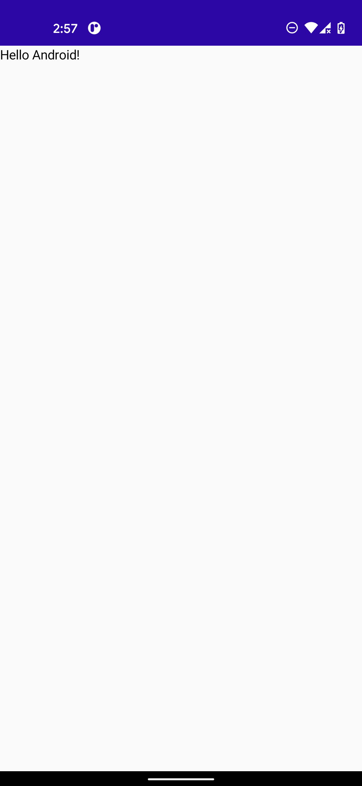
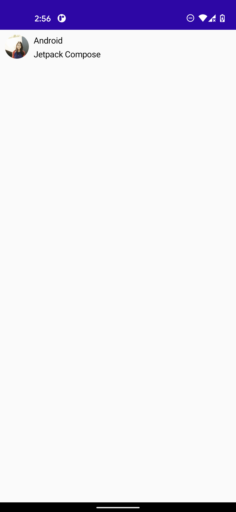
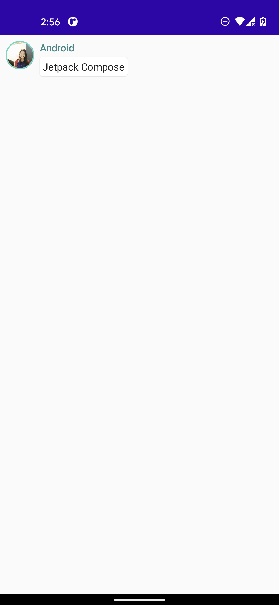

# JetpackCompose Tutorial

This folder is the source code learned at the following site.
https://developer.android.com/jetpack/compose/tutorial

|lesson1|lesson2|
|:---:|:---:|
|||
|lesson3|lesson4|
||

